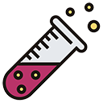
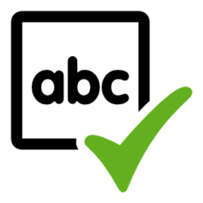

# SmartSearchAPI

## Sommario
- [Sommario](#sommario)
- [Scopo](#scopo)
- [Pacchetti e tool](#pacchetti-e-tool)
- [Lingua](#lingua)
- [Classi](#classi)
- [AI Classifier](#ai-classifier)
- [Risultato](#risultato)
- [Esempi](#esempi)
- [Considerazioni finali](#considerazioni-finali)


## Scopo
Lo scopo di questa API è quello di semplificare la ricerca di documenti, testi e altre informazioni all'interno di applicazioni web.  Il servizio deve essere in grado di estrapolare le informazioni di maggior importanza da un input in linguaggio naturale umano. Nello specifico, i due tipi di informazioni sulle quali si concentra sono:
+ parole chiave
+ range di date


## Pacchetti e tool
All'interno del progetto sono stati installati diversi pacchetti, alcuni dei quali richiedono delle versioni diverse di .Net o .Net Framework, per cui sono stati inseriti tramite l'aggiunta di più progetti alla soluzione. Di seguito la lista dei pacchetti installati con una breve descrizione e con i link utili:

<table border="solid">
    <tr>
        <td><h3 align="center">Catalyst</h3></td>
        <td>Libreria per l'elaborazione del linguaggio naturale. Permette di eseguire molto semplicemente un'analisi grammaticale del testo sottoposto.</td>
        <td><a href="https://github.com/curiosity-ai/catalyst/">GitHub</a></td>
    </tr>
    <tr></tr>
    <tr>
        <td><h3 align="center">NHunspell</h3></td>
        <td>Correttore ortografico open-source utilizzato all'interno di programmi come LibreOffice. Nel progetto viene utilizzato per trovare i sinonimi delle parole chiave ed, eventualmente, suggerire correzioni.</td>
        <td><a href="http://hunspell.github.io/">Sito</a><br><br><a href="https://github.com/hunspell/hunspell">GitHub</a><br><br><a href="https://www.codeproject.com/Articles/43495/Spell-Check-Hyphenation-and-Thesaurus-for-NET-with">Articolo con esempi</a></td>
    </tr>
    <tr></tr>
    <tr>
        <td><h3 align="center">ML.NET</h3></td>
        <td>Framework open-source di supporto per la creazione di modelli di machine learning di diverse tipologie. Nel progetto viene utilizzato per la gestione del modello Classifier.</td>
        <td><a href="https://dotnet.microsoft.com/en-us/apps/machinelearning-ai/ml-dotnet">Sito</a><br><br><a href="https://github.com/dotnet/machinelearningS">GitHub</a></td>
    </tr>
    <tr></tr>
    <tr>
        <td><h3 align="center">LemmaSharp</h3></td>
        <td>Libreria utilizzata nel progetto per la lemmatizzazione delle parole, in particolare dei verbi, in previsione di una futura implementazione di una mappatura verbo-azione.</td>
        <td><a href="http://lemmatise.ijs.si">Sito</a></td>
    </tr>
</table>


## Lingua
La lingua che ho impostato nel progetto è l'italiano. I file che contengono le informazioni necessarie sono:
<table border="solid">
    <tr>
        <td><kbd>./SmartSearchAPI/elastic_hunspell_master_dicts_it_IT.aff</kbd></td>
        <td rowspan="3">File di dizionario per Hunspell</td>
        <td rowspan="3">Scarica i file <a href="https://github.com/wooorm/dictionaries/">qui</a> oppure <a href="https://github.com/elastic/hunspell/">qui</a></td>
    </tr>
    <tr></tr>
    <tr>
        <td><kbd>./SmartSearchAPI/elastic_hunspell_master_dicts_it_IT.dic</kbd></td>
    </tr>
    <tr></tr>
    <tr>
        <td><kbd>./SmartSearchAPI/th_it_IT.dat</kbd></td>
        <td>File di lingua per Mythes</td>
        <td>Scarica i file <a href="https://extensions.openoffice.org/en/search?f%5B0%5D=field_project_tags%3A157">qui</a> oppure <a href="https://wiki.openoffice.org/wiki/Dictionaries">qui</a></td>
    </tr>
</table>

Inoltre l'intelligenza artificiale che l'API utilizza per fare l'analisi grammaticale, Catalyst, è impostata in italiano. Per selezionare l'italiano è stato necessario installare il pacchetto <kbd>Catalyst.Models.Italian</kbd> e adattare una parte di codice nella classe [SmartSearchNlpProcessor](#smartsearchnlpprocessor). Quindi per cambiare la lingua sarà necessario:
<ol>
    <li>Installare il pacchetto <kbd>Catalyst.Models.-lingua-</kbd></li>
    <li>Modificare il seguente pezzo di codice nella classe [SmartSearchNlpProcessor](#smartsearchnlpprocessor):</li>

</ol>

```cs
    Catalyst.Models.<lingua>.Register();
    Storage.Current = new DiskStorage("catalyst-models");
    var nlp = await Pipeline.ForAsync(Language.<lingua>);
    var doc = new Document(input, Language.<lingua>);
```

Anche la classe [SmartSearchTimeParser](#smartsearchtimeparser) è stata definita basandosi sul lessico e sulla sintassi italiana. Dunque, per cambiare lingua, sarà necessario almeno tradurre le parole presenti all'interno dei vettori readonly della classe e, nel peggiore dei casi, riadattare le funzioni della classe alla nuova sintassi.

Nella classe Lemmatizer, inoltre, la lingua viene impostata nel costruttore e vi è una lista di dati nel file <kbd>Lemma_train.txt</kbd> per ampliare la funzionalità del lemmatizzatore anche ai verbi con i pronomi, come "dimmi", "dammi", ecc. Per cambiare la lingua quindi servirà riscrivere il file con nuovi ed eventuali ampliamenti nella lingua scelta e cambiare questa linea di codice:
```cs
l = new LemmatizerPrebuiltFull(LanguagePrebuilt.<lingua>);
```

Infine l'intelligenza artificiale Classifier è allenata con un dataset in italiano, dunque sarà necessario ricreare il dataset e riallenarla per cambiare lingua.


## Classi

### SmartSearchResult

<table border="solid" width="470px">
    <tr><th colspan="2"><center>SmartSearchResult</center></th></tr>
    <tr></tr>
    <tr>
        <td>+</td>
        <td>Keywords&nbsp;&nbsp;:&nbsp;&nbsp;SmartSearchKeyword [0 .. *]</td>
    </tr>
    <tr></tr>
    <tr>
        <td>+</td>
        <td>DateRanges&nbsp;&nbsp;:&nbsp;&nbsp;SmartSearchDateRange [0 .. *]</td>
    </tr>
    <tr>
        <td>+</td>
        <td>SmartSearchResult ()</td>
    </tr>
</table>
La classe SmartSearchResult è la classe che viene restituita come risultato in json. Essa contiene una lista di SmartSearchKeyword e una lista di SmartSearchDateRange, contenenti le informazioni chiave da utilizzare nell'ipotetica query.

### SmartSearchKeyword

<table border="solid" width="470px">
    <tr><th colspan="2"><center>SmartSearchKeyword</center></th></tr>
    <tr></tr>
    <tr>
        <td>+</td>
        <td>Noun&nbsp;&nbsp;:&nbsp;&nbsp;string</td>
    </tr>
    <tr></tr>
    <tr>
        <td>-</td>
        <td>isNoun&nbsp;&nbsp;:&nbsp;&nbsp;bool</td>
    </tr>
    <tr></tr>
    <tr>
        <td>+</td>
        <td>Synonyms&nbsp;&nbsp;:&nbsp;&nbsp;string [0 .. *]</td>
    </tr>
    <tr>
        <td>+</td>
        <td>SmartSearchKeyword ()</td>
    </tr>
    <tr></tr>
    <tr>
        <td>+</td>
        <td>SmartSearchKeyword (keyword: string)</td>
    </tr>
    <tr></tr>
    <tr>
        <td>+</td>
        <td>SetSynonyms (set : bool)</td>
    </tr>
    <tr></tr>
    <tr>
        <td>+</td>
        <td>GetSynonyms ()</td>
    </tr>
</table>
La classe SmartSearchKeyword serve per memorizzare in modo strutturato ogni parola chiave presente all'interno della stringa di ricerca e i rispettivi sinonimi e/o correzioni, che possono tornare utili considerando un eventuale errore dell'utente nel cercare un'informazione.

### SmartSearchVerb

<table border="solid" width="470px">
    <tr><th colspan="2"><center>SmartSearchVerb</center></th></tr>
    <tr></tr>
    <tr>
        <td>+</td>
        <td>Verb&nbsp;&nbsp;:&nbsp;&nbsp;string</td>
    </tr>
    <tr></tr>
    <tr>
        <td >+</td>
        <td>Synonyms&nbsp;&nbsp;:&nbsp;&nbsp;string [0 .. *]</td>
    </tr>
    <tr>
        <td>+</td>
        <td>SmartSearchVerb ()</td>
    </tr>
    <tr></tr>
    <tr>
        <td>+</td>
        <td>SmartSearchVerb (verb: string)</td>
    </tr>
    <tr></tr>
    <tr>
        <td>+</td>
        <td>GetSynonyms ()</td>
    </tr>
</table>
La classe SmartSearchVerb è una classe molto simile a SmartSearchKeyword che serve per mettere in evidenza il verbo della ricerca che servirà in una futura funzionalità di mappatura verbo-azione.

### SmartSearchDateRange

<table border="solid" width="470px">
    <tr><th colspan="2"><center>SmartSearchDateRange</center></th></tr>
    <tr></tr>
    <tr>
        <td>+</td>
        <td>DateMin&nbsp;&nbsp;:&nbsp;&nbsp;DateTime</td>
    </tr>
    <tr></tr>
    <tr>
        <td>+</td>
        <td>DateMax&nbsp;&nbsp;:&nbsp;&nbsp;DateTime</td>
    </tr>
    <tr></tr>
    <tr>
        <td>+</td>
        <td>Include&nbsp;&nbsp;:&nbsp;&nbsp;bool</td>
    </tr>
    <tr>
        <td>+</td>
        <td>SmartSearchDateRange ()</td>
    </tr>
    <tr></tr>
    <tr>
        <td>+</td>
        <td>SmartSearchDateRange (DateMin : DateTime, DateMax : DateTime)</td>
    </tr>
</table>
La classe SmartSearchDateRange serve per memorizzare i range di date ai quali l'utente potrebbe eventualmente riferirsi nella ricerca. Essa ha come attributi la data minima, la data massima e un dato boolean che precisa se includere o escludere il range dalla ricerca. <b>Importante:</b> mentre la data minima rappresenta il limite "largo" (>=), la data massima rappresenta il limite "stretto" (<).

### SmartSearchToken

<table border="solid" width="470px">
    <tr><th colspan="2"><center>SmartSearchToken</center></th></tr>
    <tr></tr>
    <tr>
        <td>+</td>
        <td>Data&nbsp;&nbsp;:&nbsp;&nbsp;string [0 .. *]</td>
    </tr>
    <tr></tr>
    <tr>
        <td>+</td>
        <td>DataTypes&nbsp;&nbsp;:&nbsp;&nbsp;string [0 .. *]</td>
    </tr>
    <tr></tr>
    <tr>
        <td>+</td>
        <td>Text&nbsp;&nbsp;:&nbsp;&nbsp;string</td>
    </tr>
    <tr></tr>
    <tr>
        <td>+</td>
        <td>Type&nbsp;&nbsp;:&nbsp;&nbsp;int</td>
    </tr>
    <tr></tr>
    <tr>
        <td>+</td>
        <td>Keyword&nbsp;&nbsp;:&nbsp;&nbsp;SmartSearchKeyword</td>
    </tr>
    <tr></tr>
    <tr>
        <td>+</td>
        <td>DateRange&nbsp;&nbsp;:&nbsp;&nbsp;SmartSearchDateRange</td>
    </tr>
    <tr>
        <td>+</td>
        <td>SmartSearchToken ()</td>
    </tr>
    <tr></tr>
    <tr>
        <td>+</td>
        <td>SmartSearchToken (Data : string [0 .. *], DataTypes : string [0 .. *])</td>
    </tr>
    <tr></tr>
    <tr>
        <td>+</td>
        <td>AddData (Data : string, DataType : string)</td>
    </tr>
    <tr></tr>
    <tr>
        <td>+</td>
        <td>IsMergeable (Token : SmartSearchToken) : bool</td>
    </tr>
    <tr></tr>
    <tr>
        <td>+</td>
        <td>Merge (Token : SmartSearchToken)</td>
    </tr>
    <tr></tr>
    <tr>
        <td>+</td>
        <td>Classify ()</td>
    </tr>
    <tr></tr>
    <tr>
        <td>+</td>
        <td>GetTime ()</td>
    </tr>
</table>
La classe SmartSearchToken viene utilizzata durante l'elaborazione dei dati. Essa contiene un pezzo di frase, il quale viene classificato dall'AI Classifier tramite il metodo Classify. Dopo essere stato classificato:
+ se è di tipo "keyword", viene estratto il nome che diventerà, appunto, la keyword
+ se è di tipo "tempo" si cerca di fare il merge con altri token adiacenti e infine si estrapola il range di date utilizzando il metodo GetTime

### SmartSearchNlpProcessor

<table border="solid" width="470px">
    <tr><th colspan="2"><center>SmartSearchNlpProcessor</center></th></tr>
    <tr>
        <td>+</td>
        <td>SmartSearchNlpProcessor ()</td>
    </tr>
    <tr></tr>
    <tr>
        <td>+</td>
        <td>ProcessAsync (input : string) : {string, string}[0 .. *]</td>
    </tr>
</table>
La classe SmartSearchNlpProcessor contiene il modello di Catalyst per l'analisi grammaticale della frase che viene fatta all'inizio del programma.

### SmartSearchTimeParser

<table border="solid" width="470px">
    <tr><th colspan="2"><center>SmartSearchTimeParser</center></th></tr>
    <tr>
        <td>+</td>
        <td>SmartSearchTimeParser ()</td>
    </tr>
    <tr></tr>
    <tr>
        <td>+</td>
        <td>GetTime (text : string[0 .. *], index : int) : SmartSearchDateRange</td>
    </tr>
    <tr></tr>
    <tr>
        <td>+</td>
        <td>Next (text : string[0 .. *], index : int) : int</td>
    </tr>
    <tr></tr>
    <tr>
        <td>+</td>
        <td>IsConj (text : string) : bool</td>
    </tr>
    <tr></tr>
    <tr>
        <td>+</td>
        <td>IsNConj (text : string) : bool</td>
    </tr>
    <tr></tr>
    <tr>
        <td>+</td>
        <td>IsPrep (text : string) : bool</td>
    </tr>
    <tr></tr>
    <tr>
        <td>+</td>
        <td>IsDay (text : string) : bool</td>
    </tr>
    <tr></tr>
    <tr>
        <td>+</td>
        <td>IsDate (text : string) : bool</td>
    </tr>
    <tr></tr>
    <tr>
        <td>+</td>
        <td>IsExpression (text : string) : bool</td>
    </tr>
    <tr></tr>
    <tr>
        <td>+</td>
        <td>IsExpression2 (text : string) : bool</td>
    </tr>
    <tr></tr>
    <tr>
        <td>+</td>
        <td>IsName (text : string) : bool</td>
    </tr>
    <tr></tr>
    <tr>
        <td>+</td>
        <td>IsHour (text : string) : bool</td>
    </tr>
    <tr></tr>
    <tr>
        <td>+</td>
        <td>IsDayOfWeek (text : string) : bool</td>
    </tr>
    <tr></tr>
    <tr>
        <td>+</td>
        <td>IsMonth (text : string) : bool</td>
    </tr>
    <tr></tr>
    <tr>
        <td>+</td>
        <td>IsYear (text : string) : bool</td>
    </tr>
</table>
La classe SmartSearchTimeParser è la classe utilizzata all'interno di ogni SmartSearchToken di tipo "tempo" per estrapolare il range di date tramite la funzione GetTime.


## AI Classifier

L'AI Classifier è stata allenata grazie a ML.NET. Il modello è, come suggerisce il nome, un classificatore: lo scenario scelto è infatti la Classificazione dei dati.


Le etichette utlizzate nella classificazione sono le seguenti:

+ 0 $\rightarrow$ tempo
+ 1 $\rightarrow$ keyword
+ 2 $\rightarrow$ altro

Il modello è stato allenato su più di 6000 espressioni in italiano, create anche grazie all'ausilio di ChatGPT. Il modello viene utilizzato nel programma per classificare le parti della frase nelle tre classi sopra menzionate, che verranno successivamente elaborate.

Il dataset utilizzato per l'allenamento del modello si trova nel file <kbd>Classifier_train.txt</kbd>. La struttura di ogni riga del file è la seguente:
<center>parola/frase + tab + etichetta</center>


## Risultato
Il valore restituito dalla chiamata all'API è un json che rappresenta la classe [SmartSearchResult](#smartsearchresult). La classe è composta da una lista di [SmartSearchVerb](#smartsearchverb), una lista di [SmartSearchKeyword](#smartsearchkeyword) e una lista di [SmartSearchDateRange](#smartsearchdaterange).


## Esempi
Di seguito alcuni esempi di chiamate all'API:
+ input: "<b>mostrami i documenti di gennaio</b>"
```json
{
  "verbs": [
    {
      "verb": "mostrare",
      "synonyms": [
        "dimostrare",
        "esibire",
        "esporre",
        "indicare",
        "palesare",
        "presentare"
      ]
    }
  ],
  "keywords": [
    {
      "noun": "documenti",
      "synonyms": [
        "documento",
        "attestato",
        "carta",
        "certificato",
        "certificazione",
        "documentazione",
        "prova",
        "testimonianza",
        "attestazione",
        "atto",
        "dichiarazione"
      ]
    }
  ],
  "dateRanges": [
    {
      "dateMin": "2023-01-01T00:00:00",
      "dateMax": "2023-02-01T00:00:00",
      "include": true
    }
  ]
}
```

+ input: "<b>cerca le relazioni dell'anno scorso</b>"
```json
{
  "verbs": [
    {
      "verb": "cercare",
      "synonyms": [
        "agognare",
        "ambire",
        "anelare",
        "aspettarsi",
        "aspirare",
        "attendersi",
        "bramare",
        "perseguire",
        "cacciare",
        "frugare",
        "indagare",
        "inquisire",
        "ricercare",
        "rovistare"
      ]
    }
  ],
  "keywords": [
    {
      "noun": "relazioni",
      "synonyms": [
        "relazione",
        "attinenza",
        "connessione",
        "legame",
        "nesso",
        "rapporto",
        "vincolo"
      ]
    }
  ],
  "dateRanges": [
    {
      "dateMin": "2022-01-01T00:00:00",
      "dateMax": "2023-01-01T00:00:00",
      "include": true
    }
  ]
}
```

+ input: "<b>dammi i bonifici dal 21 luglio 2022</b>"
```json
{
  "verbs": [
    {
      "verb": "dare",
      "synonyms": [
        "affidare",
        "consegnare",
        "porgere",
        "prescrivere",
        "somministrare",
        "applicare",
        "stendere",
        "affibbiare",
        "sferrare",
        "vibrare",
        "donare",
        "offrire",
        "regalare",
        "corrispondere",
        "pagare",
        "versare",
        "comunicare",
        "diffondere",
        "trasmettere",
        "accordare",
        "concedere",
        "aggiudicare",
        "assegnare",
        "conferire",
        "attribuire",
        "riconoscere",
        "impartire",
        "infliggere",
        "arrecare",
        "cagionare",
        "causare",
        "provocare"
      ]
    }
  ],
  "keywords": [
    {
      "noun": "bonifici",
      "synonyms": [
        "bonifico",
        "abbuono",
        "riduzione",
        "ordine di versamento"
      ]
    }
  ],
  "dateRanges": [
    {
      "dateMin": "2022-07-21T00:00:00",
      "dateMax": "9999-12-31T23:59:59.9999999",
      "include": true
    }
  ]
}
```

+ input: "<b>fammi vedere le transazioni di gennaio tranne quelle del 21 gennaio</b>"
```json
{
  "verbs": [
    {
      "verb": "vedere",
      "synonyms": [
        "attività",
        "lavoro",
        "atteggiamento",
        "contegno",
        "maniera",
        "agire",
        "compiere",
        "mettere in atto",
        "operare",
        "costruire",
        "edificare",
        "fabbricare",
        "formare",
        "comporre",
        "creare",
        "effettuare",
        "elaborare",
        "eseguire",
        "realizzare",
        "produrre",
        "eleggere",
        "nominare",
        "promuovere",
        "credere",
        "giudicare",
        "ritenere",
        "adattarsi",
        "confarsi",
        "convenire",
        "essere utile",
        "assistere",
        "contattare",
        "controllare",
        "esaminare",
        "guardare",
        "incontrare",
        "rivedere",
        "sognare",
        "trovare"
      ]
    }
  ],
  "keywords": [
    {
      "noun": "transazioni",
      "synonyms": [
        "transazione",
        "accomodamento",
        "accordo",
        "aggiustamento",
        "compromesso",
        "conciliazione",
        "concordato",
        "convenzione",
        "esborso",
        "pagamento",
        "scambio"
      ]
    }
  ],
  "dateRanges": [
    {
      "dateMin": "2023-01-01T00:00:00",
      "dateMax": "2023-02-01T00:00:00",
      "include": true
    },
    {
      "dateMin": "2023-01-21T00:00:00",
      "dateMax": "2023-01-22T00:00:00",
      "include": false
    }
  ]
}
```


## Considerazioni finali
Il progetto può risultare utile per implementare facilmente un semplice sistema di ricerca intelligente. Naturalmente può essere di gran lunga migliorato e modificato per renderlo più efficace ed efficente. In particolare la funzione GetTime all'interno della classe [SmartSearchTimeParser](#smartsearchtimeparser) ha bisogno di un notevole miglioramento, dato che non utilizza l'analisi del linguaggio naturale bensì una implementazione intelligente di una funzione che va a controllare ogni singolo caso con una serie di condizioni. Inoltre, il programma, pur riportando i verbi nell'output, non tiene conto di che azione essi rappresentino. Una futura implementazione di questa API dovrà considerare anche una funzionalità di mappatura verbo-azione, grazie alla quale l'utente potrà svolgere azioni, anche complesse, semplicemente digitando nel campo di ricerca. Infine, in questa versione del programma i nomi propri (delle aziende/clienti) vengono considerati come keyword insieme a nomi comuni (come "fatture", "relazioni", ecc). Sarà dunque necessario trovare un metodo per distinguere i nomi proprio dai nomi comuni.